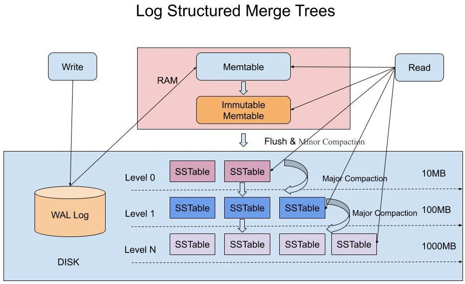
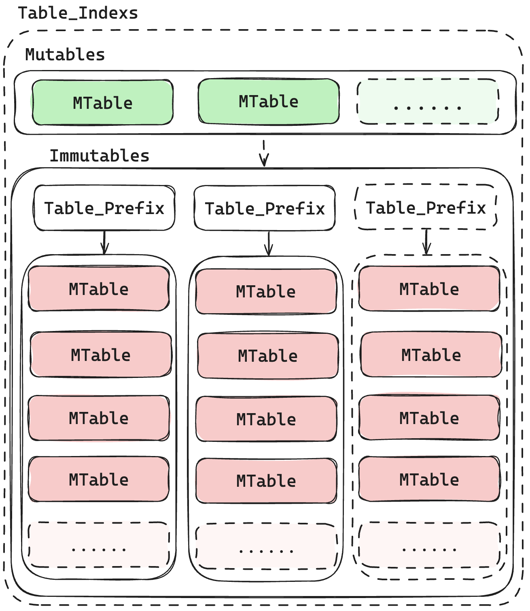
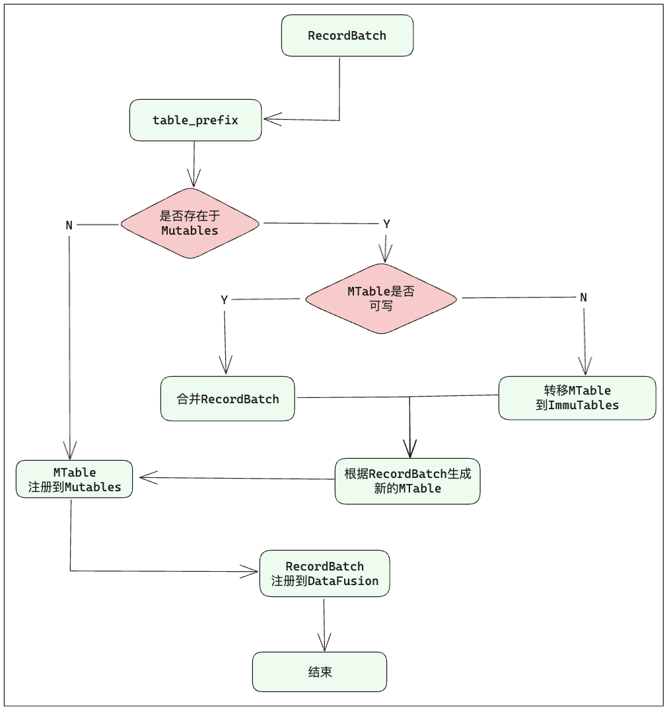

### 需要实现的功能
- [ ] 以arrow为底座,arrow flight为主要通信方式(可以添加具体其他业务接口)
  - [ ] hankshand （*HandshakeRequest*）
    - [x] (接口打通)
  - [ ] list_flights
  - [ ] get_flight_info
  - [ ] poll_flight_info
  - [ ] get_schema
  - [ ] do_get
  - [ ] do_put
  - [ ] do_exchange （暂不实现）
  - [ ] do_action（*Action*）（暂不实现）
  - [ ] list_actions （暂不实现）

- [ ] 拥有实时数据库和历史数据库
  - [ ] rtdb 实时数据库
  - [ ] htdb 历史数据库

- [ ] 拥有实时数据的订阅、订阅功能

  - [ ] 可以通过websocket获取订阅的实时数据（具体接口还没考虑清楚）

    ```shell
    ws://xxx:8093/subscribe
    ```

  - [ ] 可以通过webhook去分发订阅的数据（通过do_active方法）

- [ ] 拥有历史数据的查询功能

  - [ ] 可查询时间段内的所有数据

    ```sql
    select * from 'table_name' where time > xxx and time < xxx ;
    ```

  - [ ] 可查询时间段内的归档数据(前提是归档要提前设置为任务)

    ```sql
    select * from 'archiving_table_name'  
    ```

- [ ] 可以设置任务:
  - [ ] 值计算（加减乘除）
  - [ ] 业务计算：
    - [ ] 当某个值 == x x 的时候，执行xxx操作


---

### Arrow Flight (version=1)

#### 1、BasicAuth

- username：账号

- password：密码

#### 2、FlightDescriptor

- Path：路径
- Cmd：命令
- Unknown：位置类型

#### 3、Ticket

#### 4、Action

#### 5、Criteria

- 用于 *list_flights( )* 方法，用于获取指定条件的flight集合
- v1版本，只能用于表示table_name;


---

### Mobiusdb-flight模块

mobius-flight模块是mobiusdb的网络层，主要用于处理网络服务，采用了arrow-flight为交互协议。

- [ ] 修改返回的流的数据结构

---

### Mobiusdb-lsm模块

mobius-lsm模块是mobiusdb的持久层，通过LSM树实现了数据的高效落盘。架构图如下：




#### *一、LsmCommand*

LSM本身内部是高度聚合的，对外只提供了一系列接口，细节功能并不对外暴露。这一系列接口是：

**1、Append**

向LSM系统中添加数据

((*Vec*<*FlightData*>, *oneshot*::*Sender*<*bool*>)),

**2、OffsetList**

返回指定数据表的索引

((*String*, *oneshot*::*Sender*<*Vec*<*Offset*>>)),

**3、Table**

查询指定表的数据，

((*String*, *oneshot*::*Sender*<*Option*<*RecordBatch*>>)),

 **4、Query**

通用查询接口，支持SQL

((*String*, *oneshot*::*Sender*<*Option*<*RecordBatch*>>)),

**5、TableList**

查询LSM系统维护的所有的表

(*oneshot*::*Sender*<*Option*<*Vec*<*TableName*>>>),


#### 二、Data_Utils

##### TODO

- [x] batch_sort: 对batch以指定column进行排序


#### 三、WALLog模块

- [x] WalMsg结构设计
- [x] WalLog文件的读写
- [x] WalLog文件的管理流程
  - [x] WalLog文件大小设置
  - [x] WalLog持续写入
  - [x] 重启恢复
    - [x] 新增WalLog的load( )
    - [x] Vec<WalMsg>的Decode方法

#### 四、MemTable



1、mutables中存储的memtable不一定都是mutable，也有可能是immutable。在新数据写入后，immutable会转移到immtables中。

##### MemTableService流程图



##### TODO

- [x] MemTable的结构设计

  - [ ] Table_indexs结构设计
  - [ ] 

- [x] 打通wal和memtable_service

  - [x] 数据通过写入wal，也能写入memtable_service

    - [ ] >[注意:]
          >
          > 一个RecordBatch经过**batches_to_flight_data**和**flight_data_to_batches**转换回一个新的RecordBatch之后，尽管内容没有变化，但是在内存中大小发生了变化；

  - [x] Memtable_service能够观察到数据变化，mutables --> immtables的变化

  - [ ] 监控immtables中相同prefix的memtable的变化

#### 五、SSTable

##### TODO

- [ ] MemTable落盘Parquet文件
- [ ] Parquet文件的合并
- [ ] 大文件合并(L3、L4级别的文件合并)
- [ ] SSTable数据查询


