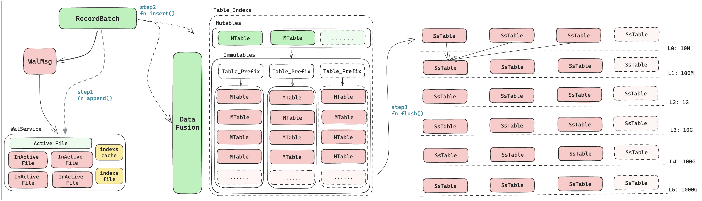

### Mobiusdb-lsm模块

mobius-lsm模块是mobiusdb的持久层，通过LSM树实现了数据的高效落盘。架构图如下：

#### 三、WAL模块

- [x] WalMsg结构设计
- [x] WalLog文件的读写
- [x] WalLog文件的管理流程
  - [x] WalLog文件大小设置
  - [x] WalLog持续写入
  - [x] 重启恢复
    - [x] 新增WalLog的load( )
    - [x] Vec<WalMsg>的Decode方法

#### 四、MemTable

1、mutables中存储的memtable不一定都是mutable，也有可能是immutable。在新数据写入后，immutable会转移到immtables中。

##### MemTableService流程图

##### TODO

- [x] MemTable的结构设计

  - [ ] Table_indexs结构设计
  - [ ] 

- [x] 打通wal和memtable_service

  - [x] 数据通过写入wal，也能写入memtable_service

    - [ ] >[注意:]
      >
      >一个RecordBatch经过**batches_to_flight_data**和**flight_data_to_batches**转换回一个新的RecordBatch之后，尽管内容没有变化，但是在内存中大小发生了变化；

  - [x] Memtable_service能够观察到数据变化，mutables --> immtables的变化

  - [ ] 监控immtables中相同prefix的memtable的变化

#### 五、SSTable

##### TODO

- [ ] MemTable落盘Parquet文件
- [ ] Parquet文件的合并
- [ ] 大文件合并(L3、L4级别的文件合并)
- [ ] SSTable数据查询

