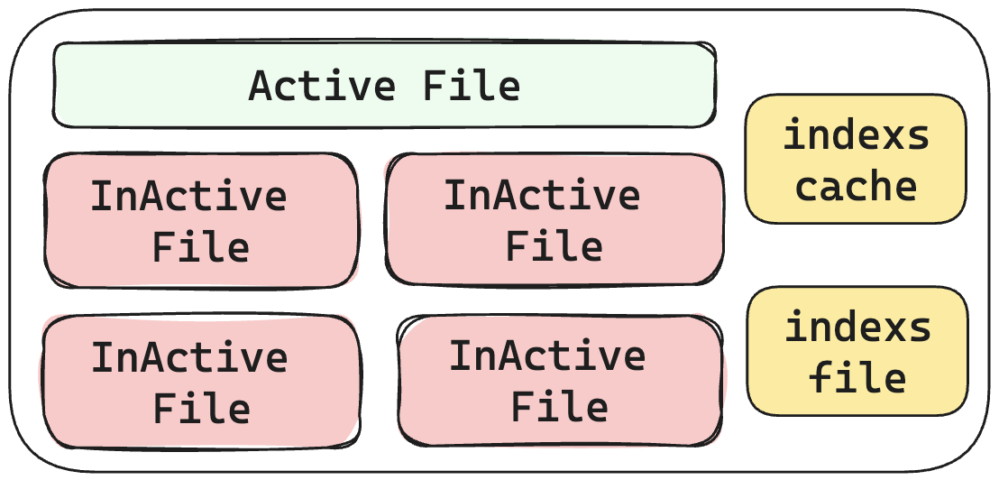

## WAL模块

Wal_service模块是LSMTree的补充，是数据安全的保证。




### Trait设计

##### 1、Encoder 和 Decoder

```rust
pub trait Encoder: Sync + Send + 'static {
    type Error;
    fn encode(&self, buffer: &mut BytesMut) -> Result<usize, Self::Error>;
}
```

```rust
pub trait Decoder: Sync + Sized + Send + 'static {
    // 错误类型
    type Error;
    // 将bytes解析为对应的报文
    fn decode(bytes: Bytes) -> Result<Self, Self::Error>;
}
```


##### 2、IntoWalMsg

将其他数据转换为WalMsg,这个约束是Wal模块适配其他数据的接口，只有实现了这个约束的数据才能正常使用WAL的功能！

```rust
pub trait IntoWalMsg {
    fn into_wal_msg(&self) -> WalMsg;
}
```


##### 3、Wal

```rust
#[allow(async_fn_in_trait)]
pub trait Wal {
  	// 追加一条数据
    async fn append(&mut self, data: impl IntoWalMsg) -> Result<Offset>;
		// 加载WAL文件
    async fn load(&self, path: impl Into<String>) -> Result<bool>;
}
```

### 数据结构：

##### 1、WalService

```rust
#[derive(Debug)]
pub struct WalService {
    path: String,
    wal: ActiveWal,
    wal_max_size: usize,
    // 记录ActiveWal文件中的offset
    pub(crate) indexs: Vec<Offset>,
    // 记录ActiveWal文件中的offset, key为wal文件名, value为offset
    pub(crate) indexs_map: HashMap<String, Vec<Offset>>,
}
```


##### 2、WalMsg

```rust
#[derive(Debug, Default, Clone, PartialEq, Eq)]
pub struct WalMsg {
  	// vec中元素的个数
    num: u16,
  	// 表示bytes切分的长度
    indexs: Vec<u32>,
  	// 真实的数据
    bytes: Bytes,
}
```


使用WalMessage 替代 WalMsg

```rust
#[derive(Debug,Clone)]
pub struct WalMessage {
    data_len: u32,
    bytes: Bytes
}
```


##### 3、Offset

```rust
#[derive(Debug, PartialEq, Clone)]
pub struct Offset {
    pub(crate) offset: usize,
    pub(crate) len: usize,
}
```


